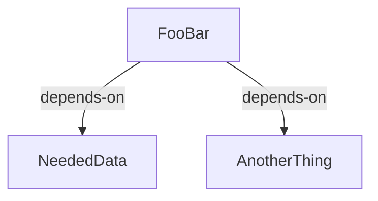

# buildable-dataclasses

[](https://pypi.python.org/project/buildable-dataclasses)
[](https://opensource.org/licenses/MIT)
[](https://beartype.readthedocs.io)
[](https://github.com/dertilo/python-linters/blob/master/python_linters/ruff.toml)

batch-processing pipelines via nested dataclasses

### example batch-processing pipeline
- one first has to compute the dependencies before you can compute the FooBar itself


### DAG declared via `Buildable`-dataclasses (foobar-example)
```python
@dataclass
class FooBar(Buildable):
    dependency_a: NeededData # another buildable dataclass
    dependency_b: AnotherThing # yet another buildable dataclass
    
    some_result: SomeDataContainer # whatever type you want

    def _build_self(self):
        self.some_result=some_fancy_processing(self.dependency_a, self.dependency_b)
    
data=FooBar(NeededData(), AnotherThing())
data.build() # first builds the dependencies then the dataclass itself (_build_self)
```
- everything is happening in memory, what about writing results to disk?

### BuildableData (foobar-example)
- writing processed data to disk (or S3/wherever)
```python
@dataclass
class FooBarData(BuildableData):
    dependency_a: NeededData
    dependency_b: AnotherThing

    @property
    def processed_data_file(self) -> str:
        return f"{self.data_dir}/processed_data.whatever"
    
    @property
    def _is_data_valid(self) -> bool:
        return Path(self.processed_data_file).is_file()

    def _build_data(self) -> None:
        processed_data=fancy_processing(self.dependency_a, self.dependency_b)
        write(self.processed_data_file, processed_data)
        
    def example_reading_method(self)->ProcessedData:
        return read(self.processed_data_file)

data=FooBarData(NeededData(), AnotherThing())
data.build() #  processes data and writes it to disk
# in another python-process or another day
probably_already_processed=FooBarData(NeededData(), AnotherThing())
probably_already_processed.build() # does NOT reprocess your data cause "is_data_valid" returns True
my_data=data.example_reading_method() 
```
